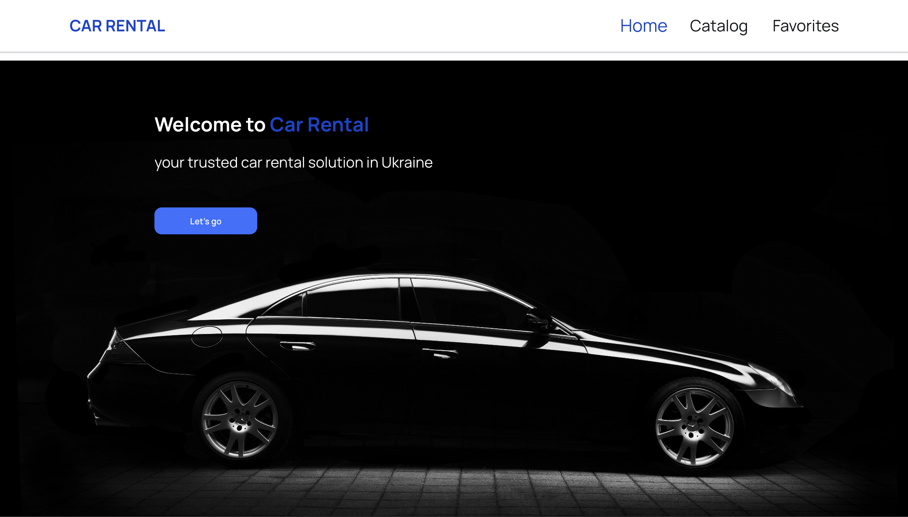
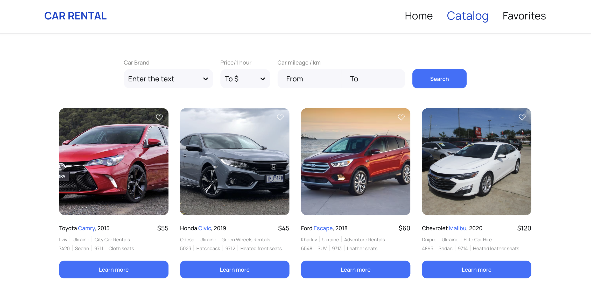
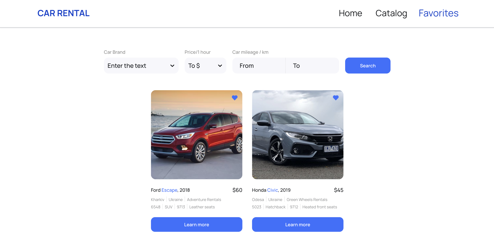

# Car Rental App

Welcome to the Car Rental App! This application helps you discover car rental services in Ukraine. Whether you're searching for specific cars, checking prices, or browsing user listings, this app has you covered.

# How to Use

## 1. Home
The home page gives you a quick overview of the car rental services. It's the starting point to explore the app

## 2. Car Catalog
Explore different cars using filters:

Brand: Find cars from your favorite brand.
Hourly Rental Price: Sort cars based on hourly rates.
Mileage: Filter by the distance the car has traveled.

## 3. User Favorites
Discover unique listings added by users. This section expands your choices beyond the standard catalog.

## 4. Getting Started
Visit https://codeolga.github.io/car-park-test/ to explore the Car Rental Application.

